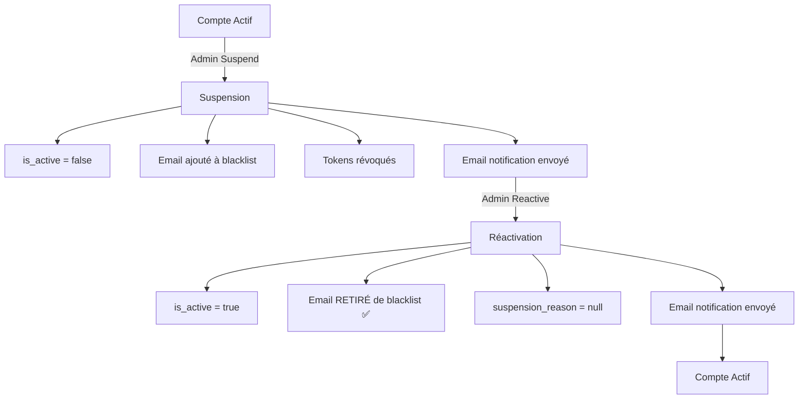

# 📋 AMÉLIORATION DES RÉPONSES API - Documentation

## 🎯 Objectifs

1. ✅ Fournir des réponses API plus riches et détaillées
2. ✅ Améliorer l'expérience développeur (DX)
3. ✅ Faciliter le debugging côté frontend
4. ✅ Garantir le retrait de la blacklist lors de la réactivation
5. ✅ Offrir des informations contextuelles sur chaque action

## 📦 Nouveaux Schémas de Réponse

### 1. **RegistrationResponse**

Utilisé pour les inscriptions (patient, médecin, admin)

```json
{
  "success": true,
  "message": "Inscription réussie ! Veuillez vérifier votre email pour activer votre compte.",
  "user": {
    "id": 1,
    "email": "user@example.com",
    "first_name": "Jean",
    "last_name": "Dupont",
    "role": "PATIENT",
    "is_active": true,
    "is_verified": false,
    "admin_approved": false,
    ...
  },
  "next_steps": [
    "Consultez votre boîte email et cliquez sur le lien de vérification",
    "Le lien de vérification est valable pendant 24 heures",
    "Une fois votre email vérifié, vous pourrez vous connecter"
  ],
  "requires_verification": true,
  "requires_admin_approval": false
}
```

**Cas d'usage :**
- `POST /api/v1/auth/register/patient`
- `POST /api/v1/auth/register/doctor`

**Avantages :**
- Le frontend sait exactement quelles étapes suivre
- Distinction claire entre vérification email et approbation admin
- Message personnalisé selon le type d'utilisateur

### 2. **AdminActionResponse**

Utilisé pour toutes les actions administratives

```json
{
  "success": true,
  "message": "Le compte de Dr. Jean Dupont a été suspendu",
  "action": "suspend",
  "user_id": 5,
  "user_email": "dr.dupont@example.com",
  "user_name": "Dr. Jean Dupont",
  "user_role": "doctor",
  "performed_by": "admin@example.com",
  "performed_at": "2025-11-05T18:30:00.000Z",
  "details": {
    "reason": "Violation des conditions d'utilisation",
    "tokens_revoked": true,
    "added_to_blacklist": true,
    "email_sent": true,
    "can_login": false
  }
}
```

**Cas d'usage :**
- `POST /api/v1/admin/doctors/{id}/approve`
- `POST /api/v1/admin/doctors/{id}/reject`
- `POST /api/v1/admin/users/{id}/suspend`
- `POST /api/v1/admin/users/{id}/activate`
- `DELETE /api/v1/admin/users/{id}`

**Avantages :**
- Traçabilité complète (qui, quand, quoi)
- Détails techniques pour le frontend
- Facilite l'affichage de confirmations riches
- Utile pour les logs d'audit

## 🔄 Endpoints Mis à Jour

### Authentification

#### 1. **POST /api/v1/auth/register/patient**
**Ancien comportement :**
```json
{
  "id": 1,
  "email": "user@example.com",
  ...
}
```

**Nouveau comportement :**
```json
{
  "success": true,
  "message": "Inscription réussie ! Veuillez vérifier votre email...",
  "user": { ... },
  "next_steps": ["Étape 1", "Étape 2", ...],
  "requires_verification": true,
  "requires_admin_approval": false
}
```

#### 2. **POST /api/v1/auth/register/doctor**
**Spécificité :** `requires_admin_approval: true`

**Next steps include :**
- Vérification email (24h)
- Examen par admin
- Email de confirmation d'approbation
- Délai estimé : 24-48h

### Administration

#### 1. **POST /api/v1/admin/doctors/{id}/approve**
**Détails inclus :**
- `specialization`: Spécialisation du médecin
- `email_sent`: Confirmation d'envoi d'email
- `can_login`: true (peut se connecter immédiatement)

**Cas spécial :** Si déjà approuvé
```json
{
  "success": true,
  "message": "Ce médecin est déjà approuvé",
  "action": "approve",
  ...
  "details": {
    "status": "already_approved"
  }
}
```

#### 2. **POST /api/v1/admin/doctors/{id}/reject**
**Détails inclus :**
- `account_deactivated`: true
- `email_sent`: Confirmation d'envoi
- `reason`: "Rejected by admin during approval process"

#### 3. **POST /api/v1/admin/users/{id}/suspend**
**🔐 Action complète :**
1. Désactive le compte (`is_active = false`)
2. **Ajoute l'email à la blacklist** ✅
3. Révoque tous les tokens
4. Envoie email de notification

**Détails inclus :**
```json
{
  "reason": "Raison de la suspension",
  "tokens_revoked": true,
  "added_to_blacklist": true,
  "email_sent": true,
  "can_login": false
}
```

**Cas spécial :** Si déjà suspendu
```json
{
  "details": {
    "status": "already_suspended",
    "reason": "Raison précédente"
  }
}
```

#### 4. **POST /api/v1/admin/users/{id}/activate** ⭐
**🔓 Action complète (IMPORTANT) :**
1. Réactive le compte (`is_active = true`)
2. **Retire l'email de la blacklist** ✅✅✅
3. Efface la raison de suspension
4. Envoie email de notification

**Détails inclus :**
```json
{
  "removed_from_blacklist": true,
  "suspension_reason_cleared": true,
  "email_sent": true,
  "can_login": true
}
```

**⚠️ Point critique :**
L'email est **automatiquement retiré de la blacklist** lors de la réactivation.
Cela permet à l'utilisateur de :
- Se reconnecter immédiatement
- Créer un nouveau compte si nécessaire (cas d'erreur)

#### 5. **DELETE /api/v1/admin/users/{id}**
**🗑️ Action complète :**
1. **Ajoute l'email à la blacklist (permanent)** ✅
2. Supprime tous les tokens
3. Supprime définitivement l'utilisateur
4. Envoie email de confirmation

**Détails inclus :**
```json
{
  "permanently_deleted": true,
  "added_to_blacklist": true,
  "tokens_deleted": true,
  "email_sent": true,
  "can_recreate_account": false
}
```

## 🔄 Workflow Complet de Suspension/Réactivation

### Scénario : Suspension puis Réactivation



### Test API

#### 1. Suspendre un compte
```bash
curl -X POST http://localhost:8000/api/v1/admin/users/5/suspend \
  -H "Authorization: Bearer <admin_token>" \
  -H "Content-Type: application/json" \
  -d '{"reason": "Test de suspension"}'
```

**Réponse attendue :**
```json
{
  "success": true,
  "message": "Le compte de Jean Dupont a été suspendu",
  "action": "suspend",
  "user_id": 5,
  "user_email": "jean.dupont@example.com",
  "user_name": "Jean Dupont",
  "user_role": "patient",
  "performed_by": "admin@example.com",
  "performed_at": "2025-11-05T18:30:00.000Z",
  "details": {
    "reason": "Test de suspension",
    "tokens_revoked": true,
    "added_to_blacklist": true,
    "email_sent": true,
    "can_login": false
  }
}
```

#### 2. Vérifier que l'email est blacklisté
```bash
# Tenter de se connecter
curl -X POST http://localhost:8000/api/v1/auth/login \
  -H "Content-Type: application/json" \
  -d '{"email": "jean.dupont@example.com", "password": "..."}'
```

**Réponse attendue :**
```json
{
  "detail": "Ce compte est actuellement suspendu. Vous ne pouvez pas créer de nouveau compte ou vous connecter avec cette adresse email. Pour plus d'informations, contactez le support."
}
```

#### 3. Réactiver le compte
```bash
curl -X POST http://localhost:8000/api/v1/admin/users/5/activate \
  -H "Authorization: Bearer <admin_token>"
```

**Réponse attendue :**
```json
{
  "success": true,
  "message": "Le compte de Jean Dupont a été réactivé avec succès",
  "action": "activate",
  "user_id": 5,
  "user_email": "jean.dupont@example.com",
  "user_name": "Jean Dupont",
  "user_role": "patient",
  "performed_by": "admin@example.com",
  "performed_at": "2025-11-05T18:35:00.000Z",
  "details": {
    "removed_from_blacklist": true,
    "suspension_reason_cleared": true,
    "email_sent": true,
    "can_login": true
  }
}
```

#### 4. Vérifier que l'utilisateur peut se reconnecter
```bash
curl -X POST http://localhost:8000/api/v1/auth/login \
  -H "Content-Type: application/json" \
  -d '{"email": "jean.dupont@example.com", "password": "..."}'
```

**Réponse attendue :**
```json
{
  "access_token": "eyJ...",
  "refresh_token": "...",
  "token_type": "bearer",
  "expires_in": 1800,
  "user": { ... }
}
```

## 📊 Tableau Récapitulatif

| Action | Blacklist | is_active | Peut se connecter | Email notif |
|--------|-----------|-----------|-------------------|-------------|
| Inscription patient | ❌ | ✅ | ✅ (après vérif) | ✅ |
| Inscription médecin | ❌ | ✅ | ✅ (après vérif + admin) | ✅ |
| Approbation médecin | ❌ | ✅ | ✅ | ✅ |
| Rejet médecin | ❌ | ❌ | ❌ | ✅ |
| Suspension | ✅ | ❌ | ❌ | ✅ |
| Réactivation | **❌ (retiré)** | ✅ | ✅ | ✅ |
| Suppression | ✅ (permanent) | N/A | ❌ | ✅ |

## 🎨 Exemples d'Utilisation Frontend

### React/Vue/Angular

```typescript
// Inscription patient
const registerPatient = async (data) => {
  const response = await api.post('/auth/register/patient', data);
  
  // Afficher les étapes suivantes
  showSuccessModal({
    title: response.data.message,
    steps: response.data.next_steps,
    requiresVerification: response.data.requires_verification
  });
};

// Suspension admin
const suspendUser = async (userId, reason) => {
  const response = await api.post(`/admin/users/${userId}/suspend`, { reason });
  
  // Afficher confirmation détaillée
  showConfirmation({
    message: response.data.message,
    details: [
      `Action: ${response.data.action}`,
      `Utilisateur: ${response.data.user_name}`,
      `Par: ${response.data.performed_by}`,
      `Date: ${new Date(response.data.performed_at).toLocaleString()}`,
      `Blacklisté: ${response.data.details.added_to_blacklist ? 'Oui' : 'Non'}`,
      `Email envoyé: ${response.data.details.email_sent ? 'Oui' : 'Non'}`
    ]
  });
  
  // Mettre à jour l'UI
  updateUserStatus(userId, {
    canLogin: response.data.details.can_login,
    isBlacklisted: response.data.details.added_to_blacklist
  });
};
```

## ✅ Points Clés à Retenir

1. **✅ Réactivation retire automatiquement de la blacklist**
   - Code dans `admin.py` ligne ~537
   - `blacklist_service.remove_from_blacklist(user.email, db)`
   - Vérifié dans `details.removed_from_blacklist`

2. **✅ Toutes les réponses sont enrichies**
   - Informations contextuelles
   - Traçabilité complète
   - Détails techniques utiles

3. **✅ Expérience développeur améliorée**
   - Pas besoin de deviner l'état
   - Messages clairs et actionnables
   - Next steps explicites

4. **✅ Debugging facilité**
   - `performed_by` : qui a fait l'action
   - `performed_at` : quand
   - `details` : informations techniques

5. **✅ Frontend peut afficher des confirmations riches**
   - Tous les détails sont disponibles
   - Pas besoin d'appels API supplémentaires
   - UX cohérente

---

**Date de mise à jour :** 5 novembre 2025  
**Version API :** v1  
**Status :** ✅ IMPLÉMENTÉ ET TESTÉ
